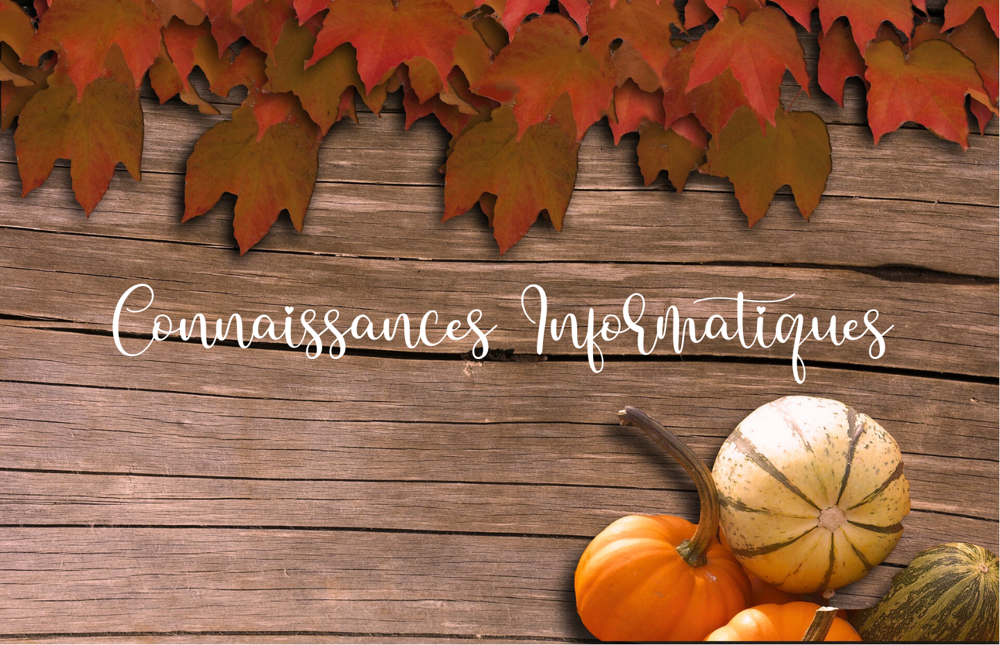

# Maroussia MAAMAR
  *Developpeuse Web junior, en formation "Developpemet Web et Accessibilité"*

[Accueil](./../README.md)- [Mon Histoire](histoire.md) - [CV](CV.md) - [Mes Projets](projets.md) - [Contact](contact.md)

---
# CV
***

* Windows /Linux
* Internet
* Pack Office
* Adobe
* Pack Microsoft
* Logiciels interne DLP
* VS Code
* Git/GitHUb
* HTML/CSS
* Javascript
* Docker
* IDE Selenium
* Photoshop
* OBS Studio
* DBeaver / SQL

* 2023-2024 - Formation Developpement Web et Accessibilité
* 2022 - Formation perfectionnement Pack Office
* 2021 - Certification Decorateur d'Interrieur (Option Modélisation 2D/3D. Moodboard)
* 2019 - Permis B
* 2015 - Bac Pro Cuisine et Restauration (Lycée des Métiers de l'Hôtellerie et du Tourisme de Saint-Quentin-en-Yvelines)
* 2014 - Bep Cuisine et Restauration (Lycée des Métiers de l'Hôtellerie et du Tourisme de Saint-Quentin-en-Yvelines)
* 2013 - CAP Cuisine (Lycée des Métiers de l'Hôtellerie et du Tourisme de Saint-Quentin-en-Yvelines)
* 2009 - Brevet des Collèges (Collège Jean Moulin de Chaville (92))
* 2007 et 2009 - Attestation Scolaire de Sécurité Routière

* Anglais - Niveau B1 plus
* Allemand - Niveau B1
* Espagnol - Débutant
* Italien - Débutant

* Février à Septembre 2023 - **Assistante Developpeuse WEB et App** à Disneyland Paris Imageenering
* Mars 2022 à Février 2023 - **Assistante de Département** Au sein de plusieurs département à Disneyland Paris
* 2019 à 2022 - **Serveuse** à Disneyland Paris
* 2017 à 2019 - **Commis de Cuisine** à Disneyland Paris
* 2016 à 2017 - **Chef de Partie Pâtisserie** à Serris au restaurant L'Interprête et Le Zèbre
* 2015 à 2016 - **Commis de Cuisine** en CDD à Disneyland Paris
*  Septembre et Octobre 2014 **Commis de Cuisine** en Irelande à l'hôtel 5* The Malton

* Musique
* Chant
* Voyage
* Dessin
* Création de sites 
* Montage Vidéo et Photos
* Couture et Broderies
* Lecture
* Bricoleuse

***
© 2023 - Maroussia MAAMAR - [Contact](contact.md)